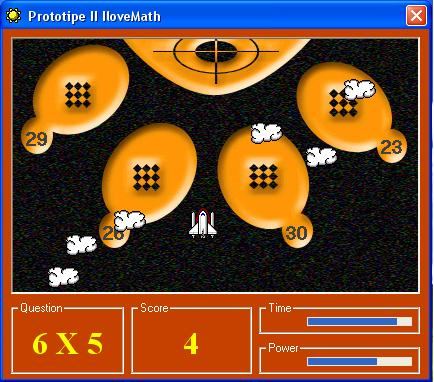



## ILoveMath

### Description

the starship have to landing on the right place,

time running out..... answer the question and

choose where you going to place the ship.

I think it's running alittle bit slow

do you've better ide plz tell me...

use keyup, down, right, & left to navigate

the starship (set form properties keypreview = True)
 
### More Info
 

             |
---                |---
**Submitted On**   |2004-09-18 15:06:50
**By**             |[N/A](https://github.com/Planet-Source-Code/PSCIndex/blob/master/ByAuthor/empty.md)
**Level**          |Intermediate
**User Rating**    |5.0 (10 globes from 2 users)
**Compatibility**  |VB 5\.0, VB 6\.0
**Category**       |[Games](https://github.com/Planet-Source-Code/PSCIndex/blob/master/ByCategory/games__1-38.md)
**World**          |[Visual Basic](https://github.com/Planet-Source-Code/PSCIndex/blob/master/ByWorld/visual-basic.md)
**Archive File**   |[ILoveMath1795779202004\.zip](https://github.com/Planet-Source-Code/ilovemath__1-56264/archive/master.zip)

### API Declarations

GetAsyncKeyState Lib "user32" (ByVal vKey As Long) As Integer

